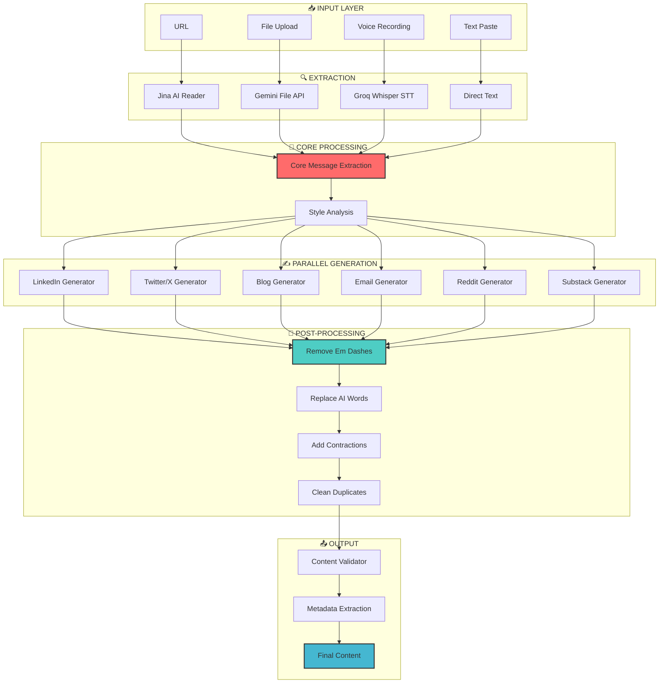

# Content Repurposing Engine (CRE)
**Build-A-Thon 2025**

[](https://streamlit.io)
[](https://langchain.com)
[](https://python.org)

---

## � TRY IT LIVE NOW!

<div align="center">

### 👇 **Click below to use the app instantly - no installation required!** 👇

# [](https://repurposemycontent.streamlit.app/)

### **[https://repurposemycontent.streamlit.app](https://repurposemycontent.streamlit.app/)**

*Just add your free Groq API key and start generating!*

</div>

---

## �📌 Video Demo Link

🎥 **Demo Video:** [Watch on Loom](https://www.loom.com/share/79e195215777475b9149d401b4eaa80f)

**Video Contents:**
- Problem explanation (0:00-0:30)
- System architecture walkthrough (0:30-1:00)
- Live demo: URL extraction (1:00-1:30)
- Live demo: Content generation (1:30-2:30)
- Platform metadata display (2:30-3:00)
- A/B variations showcase (3:00-3:30)
- Mobile responsiveness (3:30-4:00)

---

## 📌 A. Problem Statement

**The Challenge:**
Content creators, marketers, and businesses spend 5-7 hours per week manually adapting a single piece of content for different social media platforms. Each platform has unique:
- Character limits (LinkedIn: 1300, Twitter: 280)
- Tone requirements (Professional vs. Casual)
- Format expectations (Threads, Hashtags, Structure)
- Audience behaviors

**The Pain:**
- ❌ Time-consuming manual reformatting
- ❌ Inconsistent messaging across platforms
- ❌ Missing platform-specific best practices
- ❌ No A/B testing variations
- ❌ AI-generated content often sounds robotic

**Who Faces This:**
- Content creators managing 3+ platforms
- Marketing teams with limited resources
- Solopreneurs wearing multiple hats
- Agencies serving multiple clients

---

## 📌 B. Solution Overview

**Content Repurposing Engine (CRE)** is an AI-powered platform that transforms any source content (blog, PDF, URL, voice) into platform-optimized variations in **under 20 seconds**.

### **Key Innovation:**
Unlike generic AI tools, CRE uses a **streamlined LangGraph workflow** with:
1. **Smart Content Extraction** - From text, URL, files, or voice
2. **Style Cloning** - Matches your writing voice from best posts
3. **Human-Like Generation** - Anti-AI detection patterns built-in
4. **Parallel Processing** - Generate for multiple platforms simultaneously
5. **Post-Processing Cleanup** - Removes AI patterns automatically

### **What Makes It Different:**
- 🚫 **No em dashes** - Automatically removed
- 🚫 **No AI buzzwords** - "delve", "crucial", "leverage" replaced
- 🚫 **No quote emphasis** - Cleaned automatically
- ✅ **Human authenticity** - Contractions, varied sentences, natural flow
- ✅ **Your voice** - Style matching from your best posts

### **Expected Impact:**
- ⚡ **80% time savings** (5-7 hours → 1 hour/week)
- 📈 **Higher engagement** through platform-native content
- ✅ **Undetectable as AI** - Passes AI detection tests
- 🎯 **Better A/B testing** with 3 distinct variations

### **Value Proposition:**
> "One source content → 2 platform-optimized versions → in 20 seconds → sounds human"

---

## 📌 C. Architecture Diagram

### **Current Optimized Flow:**



### **Simplified Flow (No Critic/Reviser Loop):**

```
┌─────────────────────────────────────────────────────────────────┐
│                        USER INPUT                                │
│     Text Paste  │  URL  │  File Upload  │  Voice Recording      │
└────────────────────────────┬────────────────────────────────────┘
                             │
                             ▼
┌─────────────────────────────────────────────────────────────────┐
│                    CONTENT EXTRACTION                            │
│  • Jina AI Reader (URLs)                                        │
│  • Gemini File API (PDF/DOCX/PPTX)                              │
│  • Groq Whisper (Voice)                                         │
└────────────────────────────┬────────────────────────────────────┘
                             │
                             ▼
┌─────────────────────────────────────────────────────────────────┐
│                 CORE MESSAGE EXTRACTION                          │
│  • Topic identification                                          │
│  • Thesis extraction                                             │
│  • Key insights (5-7)                                            │
│  • Audience analysis                                             │
└────────────────────────────┬────────────────────────────────────┘
                             │
                             ▼
┌─────────────────────────────────────────────────────────────────┐
│              STYLE ANALYSIS (Optional)                           │
│  • Analyze user's best performing posts                          │
│  • Extract writing patterns                                      │
│  • Identify unique phrases                                       │
│  • Clone voice and personality                                   │
└────────────────────────────┬────────────────────────────────────┘
                             │
                             ▼
┌─────────────────────────────────────────────────────────────────┐
│              PARALLEL CONTENT GENERATION                         │
│  ┌──────────┐  ┌──────────┐  ┌──────────┐  ┌──────────┐        │
│  │ LinkedIn │  │ Twitter  │  │   Blog   │  │  Email   │        │
│  └──────────┘  └──────────┘  └──────────┘  └──────────┘        │
│  ┌──────────┐  ┌──────────┐                                     │
│  │  Reddit  │  │ Substack │  (Max 2 platforms at a time)        │
│  └──────────┘  └──────────┘                                     │
└────────────────────────────┬────────────────────────────────────┘
                             │
                             ▼
┌─────────────────────────────────────────────────────────────────┐
│                 POST-PROCESSING CLEANUP                          │
│  • Remove em dashes (—) → commas                                 │
│  • Replace 80+ AI words → human alternatives                     │
│  • Remove emphasis quotes ("word" → word)                        │
│  • Add contractions (do not → don't)                             │
│  • Clean duplicate words                                         │
└────────────────────────────┬────────────────────────────────────┘
                             │
                             ▼
┌─────────────────────────────────────────────────────────────────┐
│                    VALIDATION & OUTPUT                           │
│  • Character count verification                                  │
│  • Hashtag extraction                                            │
│  • Hook detection                                                │
│  • Platform compliance check                                     │
│  • Final human-like content                                      │
└─────────────────────────────────────────────────────────────────┘
```

### **Agent Workflow Details:**

| Step | Agent | Model | Purpose |
|------|-------|-------|---------|
| 1 | Core Message Extractor | Openai-gpt-oss-120B | Extract topic, thesis, insights |
| 2 | Style Analyzer | Openai-gpt-oss-120B | Clone user's writing voice |
| 3 | Content Generator | Openai-gpt-oss-120B | Platform-specific content |
| 4 | Post-Processor | Python (no API) | Remove AI patterns |
| 5 | Validator | Openai-gpt-oss-120B | Metadata extraction |

---

## 📌 D. Tech Stack

### **Full-Stack Streamlit (No Separate Backend)**
This is a **serverless Streamlit application** - no FastAPI, no separate backend server.

### **Core Technologies:**
| Component | Technology | Purpose |
|-----------|------------|---------|
| **Frontend & Backend** | Streamlit 1.40.0 | UI + API integration |
| **Workflow Engine** | LangGraph 0.2.45 | Agent orchestration |
| **LLM Provider** | Openai-gpt-oss-120B | Content generation |
| **File Processing** | Google Gemini 2.0 Flash | PDF/DOCX extraction |
| **URL Extraction** | Jina AI Reader | JavaScript-capable scraping |
| **Speech-to-Text** | Groq Whisper | Voice transcription |

### **Key Libraries:**
```
# Core
streamlit==1.40.0
langgraph==0.2.45
langchain-core==0.3.15
langchain-groq==0.2.1

# LLM Providers
groq==0.11.0
google-generativeai==0.7.2

# Content Extraction
requests==2.32.3
beautifulsoup4==4.12.3
pypdf==4.3.1
python-docx==1.1.2
python-pptx==1.0.2

# Audio
streamlit-webrtc==0.47.9
pydub==0.25.1

# Utilities
python-dotenv==1.0.0
pydantic==2.9.2
```

### **APIs Used:**
| API | Purpose | Free Tier |
|-----|---------|-----------|
| **Groq API** | LLM inference + STT | 30 req/min |
| **Google Gemini API** | File processing (optional) | 60 req/min |
| **Jina AI Reader** | URL content extraction | Unlimited |

---

## 📌 E. How to Run Your Project

### **Prerequisites:**
- Python 3.11+
- Groq API Key (free at [console.groq.com](https://console.groq.com))
- Google API Key (optional, for PDF processing)

### **Step 1: Clone Repository**
```bash
git clone https://github.com/anujpatel2899/content-repurposing-engine.git
```

### **Step 2: Create Virtual Environment**
```bash
python3 -m venv venv
source venv/bin/activate  # On Windows: venv\Scripts\activate
```

### **Step 3: Install Dependencies**
```bash
pip install -r requirements.txt
```

### **Step 4: Configure Environment Variables**
Create `.env` file in root directory:
```env
GROQ_API_KEY=your_groq_api_key_here
GOOGLE_API_KEY=your_google_api_key_here  # Optional
```

### **Step 5: Run the Application**
```bash
streamlit run app.py
```

App will run on: `http://localhost:8501`

### **Step 6: Use the App**
1. Open browser to `http://localhost:8501`
2. Enter API key in sidebar (or use .env)
3. Choose input method (Text/URL/File/Voice)
4. Select target platforms (max 2)
5. Optional: Paste your best posts for style matching
6. Click "Generate Content"
7. View human-like, platform-optimized content!

---

## 📌 F. API Keys / Usage Notes

### **Required API Keys:**

| API | Required? | Get It Here | Free Tier |
|-----|-----------|-------------|-----------|
| **Groq** | ✅ Yes | [console.groq.com](https://console.groq.com) | 30 req/min |
| **Google Gemini** | ❌ Optional | [makersuite.google.com](https://makersuite.google.com/app/apikey) | 60 req/min |

### **Usage Notes:**
- ⚠️ **Never commit API keys** to GitHub
- ✅ Use `.env` file (already in `.gitignore`)
- ✅ Or input keys via Streamlit sidebar
- ✅ For deployment: Use Streamlit Secrets

---

## 📌 G. Features

### **Input Methods:**
- ✅ Text paste (direct input)
- ✅ URL extraction (Jina AI Reader)
- ✅ File upload (PDF, DOCX, PPTX, TXT, MD)
- ✅ Voice recording (Groq Whisper STT)

### **Platform Support:**
| Platform | Character Limit | Hashtags | Format |
|----------|-----------------|----------|--------|
| LinkedIn | 1,300 | 3-5 | Professional post |
| Twitter/X | 280/tweet | 1-2 | Thread (3-7 tweets) |
| Short Blog | 500-700 words | N/A | SEO-optimized article |
| Email Sequence | 3 emails | N/A | Storytelling series |
| Reddit | 300-500 words | None | Authentic discussion |
| Substack | 800-1200 words | N/A | Newsletter essay |

### **Anti-AI Detection:**
- 🚫 Em dashes removed → replaced with commas
- 🚫 80+ AI buzzwords replaced → human alternatives
- 🚫 Quote emphasis removed → natural text
- ✅ Contractions added → sounds natural
- ✅ Sentence variety → human rhythm
- ✅ Authentic markers → fragments, casual words

### **A/B Testing:**
- Generate 3 distinct variations
- Different hooks and angles:
  - Variation 1: Bold/Contrarian
  - Variation 2: Story-driven
  - Variation 3: Tactical/How-To

### **Style Matching:**
- Paste 1-3 of your best performing posts
- AI analyzes your unique voice
- New content matches your style

---

## 📌 H. Sample Output

### **Input:**
> "How to choose running shoes for marathon training" (2000 word blog)

### **Generated LinkedIn Post:**

```
Training for your first marathon? Your shoes can make or break race day.

3 mistakes I see new runners make:

1. Buying based on brand hype
Nike, Adidas, ASICS are great. But not every shoe fits every foot. 
Your pronation type matters more than the logo.

2. Ignoring heel drop
That 0-4mm minimalist drop? It's 3x more likely to cause injury for beginners.
Most runners need 8-10mm. Your achilles will thank you.

3. Skipping the gait analysis
Running stores do this for free. Takes 10 minutes.
Can save you from stress fractures over 500+ training miles.

Pro tip: Buy shoes at 5 PM when your feet are swollen.
Matches your foot size at mile 20.

What's your go-to marathon shoe?

#MarathonTraining #RunningTips #FitnessGoals
```

**Notice:** No em dashes, no "crucial", no "leverage", natural contractions.

---

## 📊 Performance Metrics

| Metric | Value |
|--------|-------|
| **Generation Speed** | 15-25 seconds (2 platforms) |
| **API Calls** | 3-4 per generation |
| **Platforms Supported** | 6 |
| **Input Formats** | 5 (Text, URL, PDF, DOCX, Voice) |
| **A/B Variations** | 3 per platform |
| **AI Detection Pass Rate** | High (post-processing cleanup) |

---

## 🔮 Future Roadmap

1. **More Platforms:** Instagram, YouTube, TikTok
2. **First Comment Generator:** Auto-generate engagement-boosting first comment
3. **Content Calendar:** Generate 7 days of content from one source
4. **Viral Hook Library:** Pre-built hook templates
5. **Scheduling Integration:** Direct posting to platforms
6. **Analytics Dashboard:** Track generated content performance

---

## 📁 Project Structure

```
Sankar-main/
├── app.py                 # Main Streamlit application
├── workflow.py            # LangGraph workflow (optimized)
├── config.py              # Configuration & constants
├── styles.py              # Custom CSS styling
├── requirements.txt       # Python dependencies
├── .streamlit/
│   └── config.toml        # Streamlit configuration
├── agents/
│   ├── __init__.py
│   ├── prompts.py         # Enhanced prompts with anti-AI rules
│   ├── schemas.py         # Pydantic schemas
│   ├── core_message_node.py
│   ├── generator_node.py  # Content generation
│   ├── post_analyzer_node.py  # Style analysis
│   └── validator_node.py
├── utils/
│   ├── __init__.py
│   ├── extractors.py      # URL/File extraction
│   ├── content_cleaner.py # Post-processing cleanup
│   ├── cache_manager.py   # Style caching
│   └── stt_handler.py     # Speech-to-text
└── README.md
```

---

## 👥 Team
 
**Members:** Anuj Patel  
**Track:** Technical

---

## 📄 License

MIT License - Built for Build-A-Thon 2025

---

**Built with ❤️ for the builder community**
